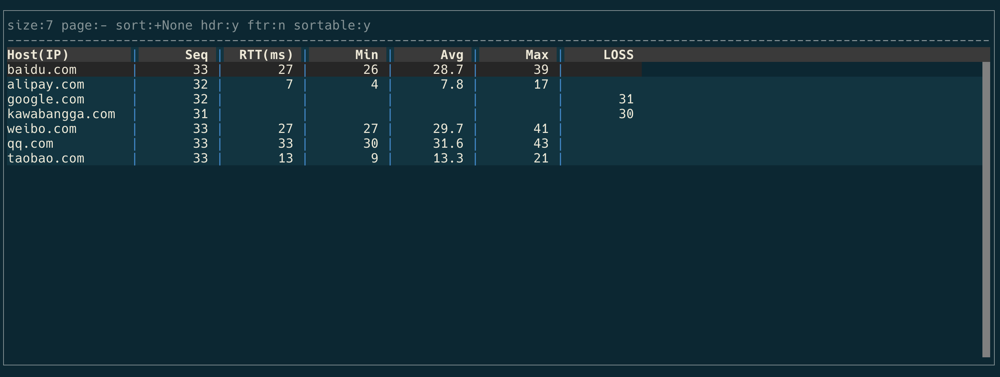

# pingtop

A top like TUI tool for ping mutiple server.



## Usage

```
pip install pingtop
```

Then ping mutiple server:
```
pingtop baidu.com google.com twitter.com
```

This project is using [click](https://click.palletsprojects.com/en/7.x/). Check helo info with `pingtop -h`.

---

Column list:
- host: host name
- ip: real ip
- minrtt: min round trip time
- maxrtt: max round trip time
- artt: average round trip time
- lost_p: lost package percentages
- lost: lost package count
- seq: icmq_seq (aka, the total sent packages)
- ttl: 


## TODO

- [ ] support count to stop
- [ ] support all ping args
- [ ] final summary
- [ ] verbose to debug
